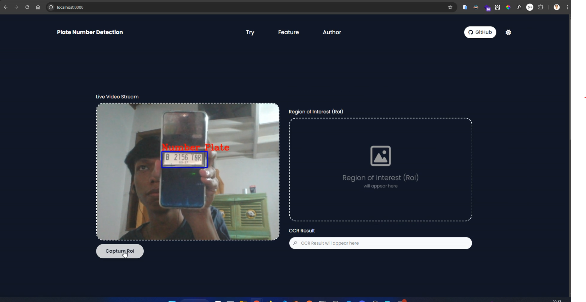

<h1 align="center">Number Plate Detection System</h1>

<div align="center">

&nbsp;
&nbsp;
&nbsp;
&nbsp;


</div>

<!--  -->

<p align="justify">This repository is web application that aims to provide various features such as video live stream, haarcascade classifier, and optical character recognition (OCR). This app is built using Python, OpenCV, Django, TailwindCSS (django-tailwind), EasyOCR</p>

## Table of Contents

-   [Demo Application](#demo-app)
-   [Tech Stack](#tech-stack)
-   [Running on Localhost](#running-on-localhost)
-   [Troubleshooting Error](#troubleshooting-error)
    -   [Commons](#commons)
        -   [Live Video Stream Camera Not Detecting](#live-video-stream-camera-not-detecting)
        -   [OpenCV imshow The function is not implemented](#opencv-imshow-the-function-is-not-implemented)
        -   [NPM_BIN_PATH Error](#npm-bin-path-error)
    -   [Windows](#windows)
        -   [PyTorch Library fbgem.dll](#pytorch-library-fbgem-dll)
        -   [OMP: Error #15: Initializing libiomp5md.dll](#omp-error-15-initializing-libiomp5mdll)
-   [Credits](#credits)

<!-- ## Demo App

https://github.com/user-attachments/assets/b2837dfc-e000-4687-99eb-3744370d05ef -->

## Tech Stack

-   Programming Language: [Python](https://www.python.org)

-   Framework: [Django](https://www.djangoproject.com)

-   Computer Vision: [OpenCV](https://opencv.org)

-   Machine Learning Framework: [PyTorch](https://pytorch.org)

-   OCR: [EasyOCR](https://github.com/JaidedAI/EasyOCR)

-   CSS Framework: [TailwindCSS](https://tailwindcss.com)

## Running on Localhost

1. Clone this repository:

```bash
git clone https://github.com/abhishekjaiswar221/number-plate-detection-system.git
```

2. Navigate to the project directory:

```bash
cd number-plate-detection-system
```

3. Copy the `.env.example` file to `.env` and update the environment variables:

```bash
cp .env.example .env
```

4. Create the virtual environment using Anaconda:

```bash
conda create -n number-plate-detection-system python==3.10
```

5. Activate the virtual environment to the current shell session

```bash
conda activate number-plate-detection-system
```

6. Install dependency required library

```bash
pip install -r requirements.txt
```

7. Install dependency tailwindcss library

```bash
python manage.py tailwind install
```

8. Running application & tailwindcss

> **NOTE**: Running this server with seperate shell session

```bash
python manage.py runserver 0.0.0.0:8000  # If the web page says "This site can’t be reached" run the below command

python manage.py runserver
```

```bash
python manage.py tailwind start
```

After the server running, open this url `http://localhost:8000` on your web browser

## Troubleshooting Error

### Commons

#### 1. Live Video Stream Camera Not Detecting

If you get this error, just reload the page browser, sometimes it likes to error (I don't know why, but if reload it it will be normal)

#### 2. OpenCV imshow The function is not implemented

> **NOTE**: This error will not appear on this application, this error will appear if you use the `imshow` function on opencv library

If you get this error message `cv2.error: OpenCV(4.10.0) /io/opencv/modules/highgui/src/window.cpp:1301: error: (-2:Unspecified error) The function is not implemented. Rebuild the library with Windows, GTK+ 2.x or Cocoa support. If you are on Ubuntu or Debian, install libgtk2.0-dev and pkg-config, then re-run cmake or configure script in function 'cvShowImage'`, just run this command

```bash
pip uninstall opencv-python-headless opencv-python
```

```bash
pip install opencv-python
```

After uninstall and install the library, just run the app again

#### 3. NPM_BIN_PATH Error

If you get a commmad error like this `CommandError: 
It looks like node.js and/or npm is not installed or cannot be found.
Visit https://nodejs.org to download and install node.js for your system.
If you have npm installed and still getting this error message, set NPM_BIN_PATH variable in settings.py to match path of NPM executable in your system. Example:
NPM_BIN_PATH = "/usr/local/bin/npm"` when running the

```bash
python manage.py tailwind install
```

command.
Add the below lines at the end of the code of your `app/settings.py` file.

```python
# NPM Bin Path
NPM_BIN_PATH = "${NodeJs_Installation_Directory}/npm.cmd"
```

### Windows

#### 1. PyTorch Library fbgem.dll

> **NOTE**: `${PATH_TO_ENV}` is dynamic location, it depends on your installation either using conda or virtualenv

If you got error the PyTorch library like this `OSError: [WinError 126] The specified module could not be found. Error loading "${PATH_TO_ENV}/lib/site-packages/torch/lib/fbgem.dll" or one of its dependencies` when running the application. You can read this forums, it's like the PyTorch library doesn't have `libomp140.x86_64.dll` file. So you can download the file and place it to the same location `fbgem.dll`

-   Discuss PyTorch - Failed to import pytorch fbgemm.dll or one of its dependencies is missing: [#22](https://discuss.pytorch.org/t/failed-to-import-pytorch-fbgemm-dll-or-one-of-its-dependencies-is-missing/201969/22)
-   Discuss PyTorch - Failed to import pytorch fbgemm.dll or one of its dependencies is missing: [#23](https://discuss.pytorch.org/t/failed-to-import-pytorch-fbgemm-dll-or-one-of-its-dependencies-is-missing/201969/23)
-   DLLme - libomp140.x86_64.dll: [Download](https://www.dllme.com/dll/files/libomp140_x86_64/00637fe34a6043031c9ae4c6cf0a891d/download)

#### 2. OMP: Error #15: Initializing libiomp5md.dll, but found libomp140.x86_64.dll already initialized.

> **NOTE**: That is dangerous, since it can degrade performance or cause incorrect results. The best thing to do is to ensure that only a single OpenMP runtime is linked into the process, e.g. by avoiding static linking of the OpenMP runtime in any library. As an unsafe, unsupported, undocumented workaround you can set the environment variable KMP_DUPLICATE_LIB_OK=TRUE to allow the program to continue to execute, but that may cause crashes or silently produce incorrect results. For more information, please see http://www.intel.com/software/products/support/.

If you get this error, you can add this code at file `manage.py`

```python
import os
os.environ["KMP_DUPLICATE_LIB_OK"]="TRUE"
```

## Credits

-   Arman Dwi Pangestu
    -   GitHub Repository - [Django_Plate_Number_Detection](https://github.com/armandwipangestu/django-plate-number-detection)
